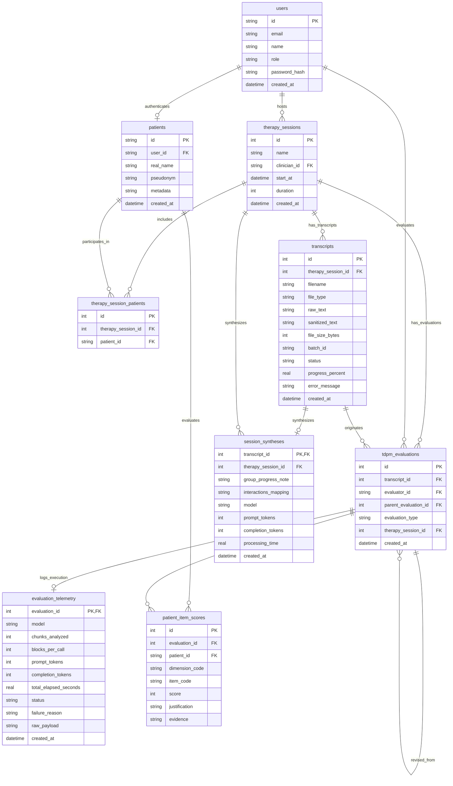

# Database Architecture

This document outlines the database schema for **Symptoms Analyser**. Building on the **Hybrid Document Store** approach, we combine schema-flexible JSON columns with a fully normalized relational structure. This enables fast clinical queries, transcript rendering, execution logging, and premium UI interactions (like hover-activated floating cards mapped to specific transcript speech turns).

---

## 1. Entity Relationship & System Architecture

The database serves as a single source of truth for the entire application. Below is the detailed Entity-Relationship diagram showcasing all tables, attributes, primary keys (PK), foreign keys (FK), and types:



---

---

## 2. Table Schemas (SQLite / DDL)

Here are the SQL table declarations designed to support high performance and future compatibility with PostgreSQL (e.g. using data types standard in both environments).

### 2.1. Core Entities

#### Therapy Sessions Table
Stores the core therapy session information, representing the main entity linking clinicians, patients, and transcripts.
```sql
CREATE TABLE IF NOT EXISTS therapy_sessions (
    id INTEGER PRIMARY KEY AUTOINCREMENT,
    name TEXT NOT NULL,                -- Public display name of the session (e.g. "Sessão 16/03/2026")
    clinician_id TEXT NOT NULL,        -- FK to users.id
    start_at DATETIME,                 -- Scheduled date and time
    duration INTEGER,                  -- Scheduled/actual duration in minutes
    created_at DATETIME DEFAULT CURRENT_TIMESTAMP,
    FOREIGN KEY (clinician_id) REFERENCES users(id) ON DELETE CASCADE
);

CREATE INDEX IF NOT EXISTS idx_sessions_clinician ON therapy_sessions (clinician_id);
```

#### Therapy Session Patients Join Table
Many-to-many relationship join table linking therapy sessions to their participating patients.
```sql
CREATE TABLE IF NOT EXISTS therapy_session_patients (
    id INTEGER PRIMARY KEY AUTOINCREMENT,
    therapy_session_id INTEGER NOT NULL,
    patient_id TEXT NOT NULL,
    FOREIGN KEY (therapy_session_id) REFERENCES therapy_sessions(id) ON DELETE CASCADE,
    FOREIGN KEY (patient_id) REFERENCES patients(id) ON DELETE CASCADE,
    UNIQUE(therapy_session_id, patient_id)
);
```

#### Transcripts Table
Preserves the complete, original source text of uploaded transcript files alongside its optional sanitized/preprocessed state.
```sql
CREATE TABLE IF NOT EXISTS transcripts (
    id INTEGER PRIMARY KEY AUTOINCREMENT, -- Changed to sequential integer
    therapy_session_id INTEGER,        -- FK to therapy_sessions.id
    filename TEXT NOT NULL,            -- Original uploaded file name (e.g., "session_2026_03_16.docx")
    file_type TEXT,                    -- e.g. "docx", "txt"
    raw_text TEXT NOT NULL,            -- Full unparsed raw speech (may contain PHI/real names)
    sanitized_text TEXT,               -- The FULL preprocessed and anonymized text block (NULL if skipped)
    file_size_bytes INTEGER,
    
    -- Async Batch & Job Processing Status
    batch_id TEXT,                     -- UUID grouping all files uploaded in this batch
    status TEXT NOT NULL DEFAULT 'queued' 
        CHECK (status IN ('queued', 'preprocessing', 'preprocessed', 'analyzing', 'completed', 'failed')),
    progress_percent REAL DEFAULT 0.0, -- Live progress tracking (0.0 to 100.0)
    error_message TEXT,                -- Error stack trace if processing failed
    
    created_at DATETIME DEFAULT CURRENT_TIMESTAMP,
    FOREIGN KEY (therapy_session_id) REFERENCES therapy_sessions(id) ON DELETE SET NULL
);

CREATE INDEX IF NOT EXISTS idx_transcripts_session ON transcripts (therapy_session_id);
CREATE INDEX IF NOT EXISTS idx_transcripts_batch ON transcripts (batch_id);
CREATE INDEX IF NOT EXISTS idx_transcripts_status ON transcripts (status);
```

#### Users Table
Tracks all authenticated system actors.
```sql
CREATE TABLE IF NOT EXISTS users (
    id TEXT PRIMARY KEY,               -- e.g. "dr_smith"
    email TEXT UNIQUE NOT NULL,        -- User email for login/auth
    name TEXT NOT NULL,                -- Full display name
    role TEXT NOT NULL CHECK (role IN ('patient', 'clinician', 'admin')), -- Auth roles
    password_hash TEXT NOT NULL,       -- Secure password hash
    created_at DATETIME DEFAULT CURRENT_TIMESTAMP
);

CREATE INDEX IF NOT EXISTS idx_users_role ON users (role);
```

#### Patients Table
Tracks the true patient registry containing sensitive Protected Health Information.
```sql
CREATE TABLE IF NOT EXISTS patients (
    id TEXT PRIMARY KEY,               -- Unique pseudonym or secure ID: e.g. "Paciente1"
    user_id TEXT UNIQUE,               -- FK to users.id
    real_name TEXT NOT NULL,           -- PHI: The patient's actual name
    pseudonym TEXT UNIQUE NOT NULL,    -- Public token: The anonymized identifier used in transcripts
    metadata TEXT,                     -- Flexible JSON: Clinical patient attributes
    created_at DATETIME DEFAULT CURRENT_TIMESTAMP,
    FOREIGN KEY (user_id) REFERENCES users(id) ON DELETE SET NULL
);

CREATE INDEX IF NOT EXISTS idx_patients_pseudonym ON patients (pseudonym);
```

#### TDPM Evaluations Table
Stores the clinical evaluation session details. Replaces `session_name` with `therapy_session_id` and uses sequential integer IDs.
```sql
CREATE TABLE IF NOT EXISTS tdpm_evaluations (
    id INTEGER PRIMARY KEY AUTOINCREMENT, -- Changed to sequential integer
    transcript_id INTEGER NOT NULL,    -- FK to transcripts.id (integer)
    evaluator_id TEXT,                 -- FK to users.id
    parent_evaluation_id INTEGER,      -- FK to tdpm_evaluations.id (integer)
    evaluation_type TEXT NOT NULL DEFAULT 'automated'
        CHECK (evaluation_type IN ('automated', 'manual', 'revised')),
    therapy_session_id INTEGER NOT NULL, -- FK to therapy_sessions.id
    created_at DATETIME NOT NULL,      -- Accurate creation datetime
    FOREIGN KEY (transcript_id) REFERENCES transcripts(id) ON DELETE CASCADE,
    FOREIGN KEY (evaluator_id) REFERENCES users(id) ON DELETE SET NULL,
    FOREIGN KEY (parent_evaluation_id) REFERENCES tdpm_evaluations(id) ON DELETE SET NULL,
    FOREIGN KEY (therapy_session_id) REFERENCES therapy_sessions(id) ON DELETE CASCADE
);

CREATE INDEX IF NOT EXISTS idx_evaluations_created_at ON tdpm_evaluations (created_at DESC);
CREATE INDEX IF NOT EXISTS idx_evaluations_session ON tdpm_evaluations (therapy_session_id);
CREATE INDEX IF NOT EXISTS idx_evaluations_transcript ON tdpm_evaluations (transcript_id);
CREATE INDEX IF NOT EXISTS idx_evaluations_evaluator ON tdpm_evaluations (evaluator_id);
```

#### Evaluation Telemetry Table
Stores computational pipeline metrics linked to TDPM Evaluations.
```sql
CREATE TABLE IF NOT EXISTS evaluation_telemetry (
    evaluation_id INTEGER PRIMARY KEY, -- FK to tdpm_evaluations.id (integer)
    model TEXT NOT NULL,               -- e.g. "google/gemma-2-9b-it"
    chunks_analyzed INTEGER,           -- Number of chunks analyzed
    blocks_per_call INTEGER,           -- Hyperparameter
    prompt_tokens INTEGER,             -- Token consumption metrics
    completion_tokens INTEGER,
    total_elapsed_seconds REAL,        -- API execution duration
    status TEXT NOT NULL DEFAULT 'success'
        CHECK (status IN ('success', 'failed')),
    failure_reason TEXT,               -- System error message if execution failed
    raw_payload TEXT,                  -- Full raw JSON response backup
    created_at DATETIME DEFAULT CURRENT_TIMESTAMP,
    FOREIGN KEY (evaluation_id) REFERENCES tdpm_evaluations(id) ON DELETE CASCADE
);
```

---

### 2.2. Clinical Scores & Evidence

#### Patient Item Scores Table
Stores scores, justifications, and structured evidence citations for specific sub-items linked to TDPM Evaluations.
```sql
CREATE TABLE IF NOT EXISTS patient_item_scores (
    id INTEGER PRIMARY KEY AUTOINCREMENT,
    evaluation_id INTEGER NOT NULL,    -- FK to tdpm_evaluations.id (integer)
    patient_id TEXT NOT NULL,          -- FK to patients.id
    dimension_code TEXT NOT NULL,      -- e.g. "19"
    item_code TEXT NOT NULL,           -- e.g. "19.1"
    score INTEGER NOT NULL,            -- Severity score
    justification TEXT,                -- Clinical reasoning text block
    evidence TEXT,                     -- JSON Array of citations
    
    FOREIGN KEY (evaluation_id) REFERENCES tdpm_evaluations(id) ON DELETE CASCADE,
    FOREIGN KEY (patient_id) REFERENCES patients(id) ON DELETE CASCADE
);

CREATE UNIQUE INDEX IF NOT EXISTS idx_patient_item_evaluation ON patient_item_scores (evaluation_id, patient_id, item_code);
CREATE INDEX IF NOT EXISTS idx_patient_item_lookup ON patient_item_scores (patient_id, dimension_code, item_code);
```

---


---

### 2.4. Qualitative Clinical Syntheses

#### Session Syntheses Table
Stores qualitative whole-session clinical summaries and client interactions networks generated from the sanitized transcripts.
```sql
CREATE TABLE IF NOT EXISTS session_syntheses (
    transcript_id INTEGER PRIMARY KEY, -- FK to transcripts.id
    therapy_session_id INTEGER NOT NULL, -- FK to therapy_sessions.id
    group_progress_note TEXT,          -- Detailed clinical progress notes of the group
    interactions_mapping TEXT,         -- JSON representing social interaction network mapping
    model TEXT,                        -- LLM model utilized
    prompt_tokens INTEGER,             -- LLM prompt token consumption
    completion_tokens INTEGER,         -- LLM completion token consumption
    processing_time REAL,              -- Total duration in seconds
    created_at DATETIME DEFAULT CURRENT_TIMESTAMP,
    FOREIGN KEY (transcript_id) REFERENCES transcripts(id) ON DELETE CASCADE,
    FOREIGN KEY (therapy_session_id) REFERENCES therapy_sessions(id) ON DELETE CASCADE
);

CREATE INDEX IF NOT EXISTS idx_syntheses_session ON session_syntheses (therapy_session_id);
```

---

## 3. Key Architectural Features & Design Decisions

### 3.1. Query Patient Evolution Over Time
Having indices on `patient_id` and `dimension_code` on the normalized tables lets the application serve instant evolution trends. 

**SQL Query to render an evolution chart for "Tristeza / Depressão" (Dimension 19) for "Paciente1":**
```sql
SELECT 
    e.session_name,
    e.created_at,
    SUM(i.score) AS dimension_sum
FROM patient_item_scores i
JOIN tdpm_evaluations e ON i.evaluation_id = e.id
WHERE i.patient_id = 'Paciente1' 
  AND i.dimension_code = '19'
GROUP BY e.id, e.session_name, e.created_at
ORDER BY e.created_at ASC;
```

---

### 3.2. Store Session Metadata and Analysis Results
Our structure retains the full flexibility of the JSON schema via `evaluation_telemetry.raw_payload` while extracting common properties:
- Fast API queries scan structural columns across both clinical metadata (`evaluation_type`, `session_name`, `created_at` on `tdpm_evaluations`) and technical telemetry (`model`, `prompt_tokens`, `completion_tokens`, `total_elapsed_seconds` on `evaluation_telemetry`).
- Complete data-rich views serve the structured JSON stored in `raw_payload` inside `evaluation_telemetry`.

### 3.3. Store Preprocessing, Analysis, & Synthesis Logs
The pipeline scripts (`preprocess.py`, `tdpm_evaluation.py`, and `synthesis.py`) record execution and LLM telemetry metrics (such as model, token counts, and execution duration) directly into `evaluation_telemetry` and `session_syntheses` automatically.

---

### 3.4. Show Complete Transcript with Floating Evidence Cards

#### How We Link Evidence to Transcript Turns
During ingestion or execution, when we parse the results JSON, we extract evidence snippets like `"00:03:18 me veio assim umas uma emoção..."`:
1. **Timestamp Extraction**: Regex parses `00:03:18`.
2. **Document Consolidation**: We assemble all evidence objects for the score, stringifying them into a single **JSON Array** (e.g. `[{"raw_evidence": "...", "extracted_timestamp": "00:03:18"}]`) and saving it directly inside `patient_item_scores.evidence`. **This completely eliminates the need for separate tables or dynamic foreign key alignments!**

#### Premium UI Interaction (Interactive Transcript View)
When loading the UI:
1. **Fetch Transcript Blocks**: The frontend fetches `raw_text` / `sanitized_text` from `transcripts`.
2. **On-the-fly Splitting**: React parses the text block in less than 0.2ms into speaker turns using a regex newline parser.
3. **Fetch Scores**: The frontend loads the `patient_item_scores` rows (which already contain nested evidence objects!).
4. **Dynamic Overlays**:
   - For each turn, the UI checks if any citation in `patient_item_scores.evidence` matches the turn's timestamp or text.
   - Matching turns get an interactive clinical highlighter in the UI.
   - Clicking a highlighted turn slides in a floating overlay card showing the symptom details.
   - Clicking a citation inside an evidence card instantly scrolls the browser view to the speech bubble matching that `extracted_timestamp`.

```
+-------------------------------------------------------------+
| 00:03:18                                                    |
| Paciente1: "Então, hoje no almoço, acho que eu estava..."   |
| [Clinical Indicator Detected]   <--- Dynamic Code highlight |
+-------------------------------------------------------------+
               |
               v (Hover / Dynamic Slide-in Card)
  +---------------------------------------------------+
  | 🌟 Espectro Tristeza / Depressão (Dimension 19)   |
  | 🏷️ Humor deprimido e anedonia (Item 19.1)          |
  | 📊 Severity Score: 2 / Max 8                      |
  |                                                   |
  | LLM Evidence:                                     |
  | "me veio assim umas uma emoção, ah, um            |
  | pouco melancólica, talvez triste"                 |
  +---------------------------------------------------+
```

---

### 3.5. Preprocessing and Local Anonymization

During the preprocessing step, the system performs lightweight local anonymization:
- The raw text (`raw_text`) is parsed, all identifying Protected Health Information (PHI) like real patient names is mapped to pseudonyms, and the resulting anonymized text is saved into `sanitized_text` in the `transcripts` table.
- This decoupled, offline step occurs before any cloud LLM services are invoked, ensuring clinical data privacy from the outset.

### 3.6. Self-Contained Source of Truth (Decoupling the Filesystem)

Adding the root `transcripts` table completely solves the challenge of running in Dockerized container environments or cloud stacks:

- **Filesystem Isolation:** Once the clinician uploads a raw file (Word Doc or raw `.txt`), the backend extracts and writes its entire contents into `transcripts.raw_text`. From this moment, **the physical file is no longer needed.**
- **Perfect Portability:** Storing the SQLite file (or database backups) completely preserves all data, removing the need to synchronize nested local folders on the filesystem (`input/preprocess`, `output/preprocess`, etc.).
- **Clinical Audits:** You can always reconstruct or verify the original text that led to a specific dimension score, ensuring the system satisfies strict medical software audit standards.

### 3.7. Full Clinical Revision History (Human Overrides & Audits)

By introducing the self-referencing foreign key **`parent_evaluation_id`** in the `tdpm_evaluations` table, we solve a critical clinical workflow challenge: **enabling clinicians to review, override, and revise automated AI assessments while maintaining a complete, legally compliant audit trail.**

#### 1. The Clinical Revision Workflow
When a clinician reviews an AI-generated evaluation:
1. **The Base Draft:** The initial automated run is saved with `evaluation_type = 'automated'` (e.g., ID `eval_ai_101`). Its computational metadata and full JSON response are saved in `evaluation_telemetry`.
2. **The Override:** If the clinician disagrees with a specific severity score (e.g., they change an item score from `4` to `2` based on clinical judgment), the system does **not** overwrite the original AI records.
3. **The Revision Entry:** The system creates a *new* evaluation record (e.g., ID `eval_rev_202`) with:
   - `evaluation_type = 'revised'`
   - `parent_evaluation_id = 'eval_ai_101'`
   - `evaluator_id = [the clinician's user_id]`
4. **Isolated Clinical Scores:** The modified scores are written as new rows in `patient_item_scores` linked to `evaluation_id = 'eval_rev_202'`.

#### 2. What this Architectural Decision Enables
*   **Immutable AI Baselines:** You preserve the exact original raw outputs and token metrics of the AI pipeline. This is vital for medical auditing and research, allowing you to retrospectively study AI scoring accuracy over time.
*   **Clinician Accountability (Sign-offs):** Every revision has an `evaluator_id` (the clinician who signed off on the change). This ensures clear legal and institutional accountability.
*   **Interactive "AI vs. Human" Diffs in the UI:** In the frontend, the React application can fetch both the revised evaluation (`eval_rev_202`) and its parent (`eval_ai_101`). The comparison dashboard can display a side-by-side view showing exactly which items the clinician modified and their custom justification text:
    ```
    Item 19.1: Humor deprimido e anedonia
    [AI Score]: 4 (Justification: "Patient expressed deep tristeza multiple times...")
    [Clinician Override]: 2 (Justification: "Tristeza was context-dependent, not persistent...")
    ```
*   **Historical Version Control:** Since `parent_evaluation_id` is a self-referencing foreign key, you can chain multiple revisions together (`AI` ➔ `Resident Revision` ➔ `Senior Attending Revision`), forming a complete clinical genealogy tree.

### 3.8. Async Batch & Job Processing (State-Machine Architecture)

In healthcare systems, processing long clinical audio transcripts through sanitization and LLM scoring is a time-consuming and resource-intensive workflow (often taking several minutes per file). To provide a responsive, lag-free user experience, **our database implements an asynchronous state-machine architecture directly on the `transcripts` table.**

This completely prevents HTTP connection timeouts, allows bulk/multi-file uploads, and lets clinicians close their browser and return later once the analysis is done.

#### 1. The Async State-Machine Flow
The progress of a transcript through the AI pipeline is tracked by the `status` state column:
*   **`queued`**: The file has been successfully uploaded and exists in the database. An offline worker thread (e.g., Celery in Python or BullMQ in Node) is notified.
*   **`preprocessing`**: The worker has picked up the file and is running the local anonymization pipeline. The worker updates the `progress_percent` column in real-time.
*   **`preprocessed`**: Local anonymization is complete. The resulting text is saved in `sanitized_text`.
*   **`analyzing`**: The transcript is chunked and sent to the LLM for TDPM scoring.
*   **`completed`**: LLM scoring is fully completed, results are loaded into `patient_item_scores`, and the technical metadata is registered in `evaluation_telemetry`.
*   **`failed`**: An error occurred in either phase. The `error_message` column stores the exact traceback for clinical admins to troubleshoot.

#### 2. What this Architectural Decision Enables
*   **Multi-File Bulk Uploads (`batch_id`)**: A clinician can drag-and-drop 10 audio transcripts at once. The system generates a single UUID `batch_id` for the entire upload. The React UI can query all transcripts matching that `batch_id` to show a unified progress dashboard for the upload.
*   **Live UI Progress Rings**: The frontend polls `/api/transcripts` (or connects via WebSockets) to fetch `progress_percent` and `status` to render smooth loading spinners, skeleton states, and live progress indicators (e.g., `"Preprocessing: 42% completed..."`).
*   **Decoupled Work Queueing**: Relational state columns allow you to use a simple polling background worker or scale up to high-performance task queues without changing the database layout.
*   **Graceful Recovery**: If the server crashes mid-analysis, a startup diagnostic task scans the database for `preprocessing` or `analyzing` rows and automatically restarts them, maintaining system reliability.

### 3.9. HIPAA-Ready PHI Separation & Pseudonym Mapping

In medical software architectures, protecting patient privacy is a legal and ethical imperative (governed by standards like HIPAA in the US and LGPD in Brazil). By completely separating Protected Health Information (PHI) from the clinical analytics pipeline, **our database achieves HIPAA-ready isolation.**

#### 1. The Anonymization Boundary
*   **The Pseudonym Key**: While **raw transcripts** (as originally uploaded and stored in `transcripts.raw_text`) naturally contain real names, spoken identifiers, and other PHI, an explicit **anonymization step** is executed during preprocessing. In this step, all real names, medical ID numbers, and contact details are identified and replaced with the patient's public, generated **`pseudonym`** (e.g. `"Paciente1"`) or generic placeholders (e.g. `"Fulano1"`). As a result, the preprocessed **anonymized texts** (`transcripts.sanitized_text`), clinical analysis prompts, LLM parameters, and downstream item score records NEVER contain real names or sensitive direct identifiers. Instead, they reference the pseudonym.
    *   **Preprocessing Pipeline Execution in `sanitized_text`**: The system parses the raw text locally and replaces real names with pseudonyms. This anonymized text is immediately saved into `sanitized_text` and then used for downstream clinical evaluations.
*   **Isolated Patient Registry**: The connection between this public pseudonym and the patient's actual sensitive details (like their true name `"João da Silva"`) is stored **strictly and exclusively** in the `patients` table.

#### 2. What this Architectural Decision Enables
*   **100% Blind LLM Pipelines**: Since raw transcripts are anonymized during preprocessing, the resulting anonymized transcripts sent to the LLM pipeline only contain the pseudonym and generic placeholders. Consequently, the external LLM APIs are never exposed to any patient PHI.
*   **Role-Based Dynamic De-anonymization**: In the UI, the frontend displays patient identity safely. When a user logs in, the API checks their role:
    *   If `users.role = 'clinician'` or `'admin'`, the API performs an internal join on `patients` to dynamically display the patient's real name on their private dashboard.
    *   If the user does not have clinical clearance, the system only reveals the pseudonym, preventing accidental exposure of sensitive medical identities.
*   **Flexible Clinical Profiles (`patients.metadata`)**: Storing patient demographics, intake details, and diagnostic history in a single schema-flexible JSON `metadata` field allows hospital staff to record patient information without altering the core relational tables.

#### 3. Securing Raw PHI (`transcripts.raw_text`)
Because the raw un-anonymized speech transcript is stored inside the database prior to sanitization, it contains direct patient PHI. To guarantee medical privacy standards, we implement the following security layers:
*   **Application-Level Column Encryption**: The `transcripts.raw_text` field is encrypted at rest prior to database insertion using a secure symmetric encryption standard (e.g., **AES-256-GCM**). The encryption keys are securely managed by a separate external Key Management Service (KMS) or environment secret store.
*   **Transient Storage & Pruning**: To minimize long-term exposure, `transcripts.raw_text` is treated as transient storage. Once the clinical assessment is validated and signed off by the clinician, a background pruning worker scrubs the raw text (sets `raw_text = NULL`), leaving only the permanent, anonymized `sanitized_text`.
*   **Access Auditing**: Direct database queries to raw transcripts are disabled at the infrastructure layer. All application-level read and decryption events on `raw_text` automatically generate immutable access logs, recording the timestamp, clinical user ID, and access context for audit purposes.

#### 4. How and When is the Patients Table Populated?
To ensure the local anonymization engine (Phase 1) has an accurate, secure dictionary for mapping real names to pseudonyms, the `patients` registry is populated via **two distinct channels**:
*   **Pre-Registration during Patient Intake (Primary / Recommended Workflow)**:
    *   **When**: Performed during the patient admission or group therapy onboarding process (prior to any audio sessions being recorded or transcripts uploaded).
    *   **How**: An administrator or clinician registers a new patient in the UI by entering their `real_name` (e.g. `"João da Silva"`) and optional demographic metadata. The system automatically creates a UUID `id` and generates a public, unique `pseudonym` (e.g. `"Paciente1"`).
    *   **Benefit**: This establishes the definitive mapping dictionary, ensuring the preprocessor immediately knows exactly how to anonymize the transcript upon upload.
*   **Dynamic On-the-Fly Fallback (Self-Healing Ingestion with Clinician Verification)**:
    *   **When**: Occurs during local preprocessing if a name is identified in the raw transcript that has no matching entry in the `patients` registry (e.g. a new participant or a clinical guest).
    *   **How**: The preprocessor flags the unrecognized name and registers a provisional, draft patient row with a newly allocated pseudonym (e.g., `"Paciente5"`).
    *   **Addressing Imperfect Raw Labels (Human-in-the-Loop)**: Because raw automated transcriptions are prone to spelling errors or speaker misidentifications (e.g. labeling `"João da Silva"` as `"Jão"` or `"J. Silva"`), the system treats all on-the-fly mappings as provisional. In the UI, the clinician is presented with an overlay to either **approve** the new auto-registered profile or **manually merge/correct** it with an existing pre-registered patient profile (e.g., mapping `"Jão"` back to `"João da Silva"`). This ensures clinical database integrity.

---

### 3.10. Qualitative Whole-Session Syntheses & Group Interaction Analysis

To complement the item-level quantitative TDPM scoring system, the database architecture supports qualitative clinical synthesis at the whole-session level.

#### 1. Clinical Context & Group Dynamics
Unlike individual evaluations, group therapy relies heavily on interaction tracking, conversational flow, and cumulative group clinical progress:
- **Group Progress Note:** A cohesive, text-based narrative summarizing the emotional climate, dominant themes, and therapeutic milestones of the session.
- **Interactions Mapping:** A serialized JSON structure representing the network/graph of communication (e.g., patient-to-patient interventions, clinician prompts, active vs. passive participants).

#### 2. Technical Metadata & Performance Auditing
To maintain performance records and monitor costs, the `session_syntheses` table stores LLM execution metadata (including model version, token counts, and processing time) for every generated synthesis. By using `transcript_id` as the primary key with a cascading foreign key to `transcripts`, each transcript maintains exactly one active clinical synthesis draft, preventing orphaned logs and ensuring data integrity.
