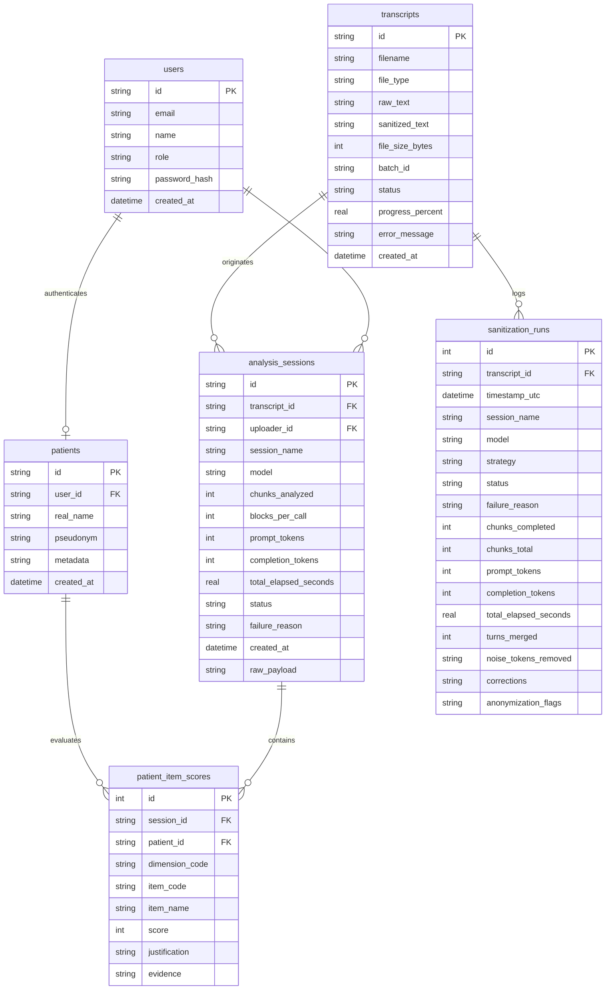

# Database Schema Plan & Implementation Guide

This document outlines a robust, future-proof database schema for **Symptoms Analyser**. Building on the **Hybrid Document Store** approach, we combine schema-flexible JSON columns with a fully normalized relational structure. This enables fast clinical queries, transcript rendering, execution logging, and premium UI interactions (like hover-activated floating cards mapped to specific transcript speech turns).

---

## 1. Entity Relationship & System Architecture

The database serves as a single source of truth for the entire application. Below is the detailed Entity-Relationship diagram showcasing all tables, attributes, primary keys (PK), foreign keys (FK), and types:



---

---

## 2. Table Schemas (SQLite / DDL)

Here are the SQL table declarations designed to support high performance and future compatibility with PostgreSQL (e.g. using data types standard in both environments).

### 2.1. Core Entities

#### Transcripts Table
Preserves the complete, original source text of uploaded transcript files alongside its optional sanitized/preprocessed state. This serves as our ultimate clinical source of truth, keeping text records lean and lightweight.
```sql
CREATE TABLE IF NOT EXISTS transcripts (
    id TEXT PRIMARY KEY,               -- e.g. "session_2026_03_16" or a UUID
    filename TEXT NOT NULL,            -- Original uploaded file name (e.g., "session_2026_03_16.docx")
    file_type TEXT,                    -- e.g. "docx", "txt"
    raw_text TEXT NOT NULL,            -- Full unparsed raw speech
    sanitized_text TEXT,               -- The FULL sanitized text block (NULL if skipped)
    file_size_bytes INTEGER,
    
    -- Async Batch & Job Processing Status
    batch_id TEXT,                     -- UUID grouping all files uploaded in this batch
    status TEXT NOT NULL DEFAULT 'queued' 
        CHECK (status IN ('queued', 'preprocessing', 'preprocessed', 'analyzing', 'completed', 'failed')),
    progress_percent REAL DEFAULT 0.0, -- Live progress tracking (0.0 to 100.0)
    error_message TEXT,                -- Error stack trace if processing failed
    
    created_at DATETIME DEFAULT CURRENT_TIMESTAMP
);

CREATE INDEX IF NOT EXISTS idx_transcripts_batch ON transcripts (batch_id);
CREATE INDEX IF NOT EXISTS idx_transcripts_status ON transcripts (status);
```

#### Users Table
Tracks all authenticated system actors (Clinicians/Healthcare Professionals, Administrators, and Patients with portal access) to support secure logins, token authorization, and multi-tenant roles.
```sql
CREATE TABLE IF NOT EXISTS users (
    id TEXT PRIMARY KEY,               -- e.g. "dr_smith", "therapist_jane", or a UUID
    email TEXT UNIQUE NOT NULL,        -- User email for login/auth (strictly required for account holders)
    name TEXT NOT NULL,                -- Full display name
    role TEXT NOT NULL CHECK (role IN ('patient', 'clinician', 'admin')), -- Auth roles
    password_hash TEXT NOT NULL,       -- Secure password hash (e.g. Bcrypt/Argon2)
    created_at DATETIME DEFAULT CURRENT_TIMESTAMP
);

CREATE INDEX IF NOT EXISTS idx_users_role ON users (role);
```

#### Patients Table
Tracks the **true patient registry** containing sensitive Protected Health Information (PHI). Completely separates real identity data from clinical runs and scores. This table serves as the secure pseudonym-matching key:
- **`real_name`** is stored *only* here for authorized clinician views.
- **`pseudonym`** (e.g., `"Paciente1"`) is public and used in transcripts, analysis prompts, and score records.
- **`user_id`** optionally links the patient profile to credentials *if* portal login access is ever granted.
```sql
CREATE TABLE IF NOT EXISTS patients (
    id TEXT PRIMARY KEY,               -- Unique patient identifier: e.g. a random UUID or secure ID
    user_id TEXT UNIQUE,               -- FK to users.id (NULL if the patient has no portal login credentials)
    real_name TEXT NOT NULL,           -- PHI: The patient's actual name (e.g. "João da Silva")
    pseudonym TEXT UNIQUE NOT NULL,    -- Public token: The anonymized identifier used in transcripts (e.g. "Paciente1")
    metadata TEXT,                     -- Flexible JSON: Clinical patient attributes (e.g., birth_date, notes)
    created_at DATETIME DEFAULT CURRENT_TIMESTAMP,
    FOREIGN KEY (user_id) REFERENCES users(id) ON DELETE SET NULL
);

CREATE INDEX IF NOT EXISTS idx_patients_pseudonym ON patients (pseudonym);
```

#### Analysis Sessions Table
Stores each pipeline run's metadata, execution status (success or failure), input/output file references, token accounts, execution duration, and a full backup of the raw LLM output. Links directly to its source transcript and logs the user account who uploaded the run.
```sql
CREATE TABLE IF NOT EXISTS analysis_sessions (
    id TEXT PRIMARY KEY,               -- Unique identifier: e.g. "session_2026_03_16.20260524_191534"
    transcript_id TEXT NOT NULL,       -- FK to transcripts.id
    uploader_id TEXT,                  -- FK to users.id (The user account who uploaded or initiated the session)
    session_name TEXT NOT NULL,        -- e.g. "session_2026_03_16"
    model TEXT NOT NULL,               -- e.g. "google/gemma-4-31b-it:free"
    chunks_analyzed INTEGER NOT NULL,  -- Number of chunks in run
    blocks_per_call INTEGER,           -- Hyperparameter
    prompt_tokens INTEGER,             -- Token accounting
    completion_tokens INTEGER,
    total_elapsed_seconds REAL,        -- Execution timing
    
    -- Execution Status (Allows auditing successful and failed executions in one table)
    status TEXT NOT NULL DEFAULT 'success',  -- 'success' or 'failed'
    failure_reason TEXT,               -- Error trace if status is 'failed'
    
    created_at DATETIME NOT NULL,      -- Accurate run datetime
    raw_payload TEXT,                  -- Full raw JSON backup (NULL if run failed)
    FOREIGN KEY (transcript_id) REFERENCES transcripts(id) ON DELETE CASCADE,
    FOREIGN KEY (uploader_id) REFERENCES users(id) ON DELETE SET NULL
);

CREATE INDEX IF NOT EXISTS idx_sessions_created_at ON analysis_sessions (created_at DESC);
CREATE INDEX IF NOT EXISTS idx_sessions_name ON analysis_sessions (session_name);
CREATE INDEX IF NOT EXISTS idx_sessions_transcript ON analysis_sessions (transcript_id);
CREATE INDEX IF NOT EXISTS idx_sessions_uploader ON analysis_sessions (uploader_id);
```

---

### 2.2. Clinical Scores & Evidence

#### Patient Item Scores Table
Stores scores, justifications, and structured evidence citations for specific sub-items (e.g., Item `19.1` - Humor deprimido e anedonia) using a hybrid relational/document model.
```sql
CREATE TABLE IF NOT EXISTS patient_item_scores (
    id INTEGER PRIMARY KEY AUTOINCREMENT,
    session_id TEXT NOT NULL,          -- FK to analysis_sessions
    patient_id TEXT NOT NULL,          -- FK to patients.id (Links to the anonymized patient record)
    dimension_code TEXT NOT NULL,      -- e.g. "19" (groups items into clinical categories)
    item_code TEXT NOT NULL,           -- e.g. "19.1"
    item_name TEXT NOT NULL,           -- e.g. "Humor deprimido e anedonia"
    score INTEGER NOT NULL,            -- Severity score (e.g. 2)
    justification TEXT,                -- Clinical reasoning text block
    evidence TEXT,                     -- JSON Array of citations: [{"raw_evidence": "...", "extracted_timestamp": "..."}]
    
    FOREIGN KEY (session_id) REFERENCES analysis_sessions(id) ON DELETE CASCADE,
    FOREIGN KEY (patient_id) REFERENCES patients(id) ON DELETE CASCADE
);

CREATE UNIQUE INDEX IF NOT EXISTS idx_patient_item_session ON patient_item_scores (session_id, patient_id, item_code);
CREATE INDEX IF NOT EXISTS idx_patient_item_lookup ON patient_item_scores (patient_id, dimension_code, item_code);
```

---

### 2.3. System Logs Ingestion

To preserve and query historic runs, we ingest and represent current JSON log files directly in the schema.

#### Sanitization Runs Table
Ingests all history from `preprocess.log.json` to monitor sanitization attempts.
```sql
CREATE TABLE IF NOT EXISTS sanitization_runs (
    id INTEGER PRIMARY KEY AUTOINCREMENT,
    transcript_id TEXT NOT NULL,          -- FK to transcripts.id
    timestamp_utc DATETIME NOT NULL,
    session_name TEXT NOT NULL,           -- e.g. "session_2026_03_16"
    model TEXT NOT NULL,                  -- Sanitization model
    strategy TEXT,                        -- e.g. "chunked_4_block(s)_per_call"
    status TEXT NOT NULL,                 -- "success" or "failed"
    failure_reason TEXT,                  -- Error detail if failed
    chunks_completed INTEGER,
    chunks_total INTEGER,
    prompt_tokens INTEGER,
    completion_tokens INTEGER,
    total_elapsed_seconds REAL,
    
    -- Ingested Sanitization Details (Only populated if status = 'success')
    turns_merged INTEGER DEFAULT 0,    -- Count of speaker turns combined
    noise_tokens_removed TEXT,          -- JSON list of removed filler tokens (e.g. ["hm", "eh"])
    corrections TEXT,                  -- JSON map of word mappings (e.g. {"veinho": "velhinho"})
    anonymization_flags TEXT,          -- JSON list of flagged sensitive words
    
    FOREIGN KEY (transcript_id) REFERENCES transcripts(id) ON DELETE CASCADE
);

CREATE INDEX IF NOT EXISTS idx_sanitization_runs_session ON sanitization_runs (session_name);
CREATE INDEX IF NOT EXISTS idx_sanitization_runs_transcript ON sanitization_runs (transcript_id);
```

---

## 3. Addressing Your Specific Objectives

### Goal 1: Query Patient Evolution Over Time
Having indices on `patient_id` and `dimension_code` on the normalized tables lets the application serve instant evolution trends. 

**SQL Query to render an evolution chart for "Tristeza / Depressão" (Dimension 19) for "Paciente1":**
```sql
SELECT 
    s.session_name,
    s.created_at,
    SUM(i.score) AS dimension_sum
FROM patient_item_scores i
JOIN analysis_sessions s ON i.session_id = s.id
WHERE i.patient_id = 'Paciente1' 
  AND i.dimension_code = '19'
GROUP BY s.id, s.session_name, s.created_at
ORDER BY s.created_at ASC;
```

---

### Goal 2: Store Session Metadata and Analysis Results
Our structure retains the full flexibility of the JSON schema via `analysis_sessions.raw_payload` while extracting common properties:
- Fast API queries scan structural columns (`model`, `tokens`, `elapsed_seconds`, `created_at`).
- Complete data-rich views serve the structured JSON stored in `raw_payload`.

---

### Goal 3: Store Existing Preprocessing & Analysis Logs
During our migration phase, a Python script will parse:
1. `output/preprocess/preprocess.log.json` ➔ inserts into `sanitization_runs`.
2. `output/tdpm_analysis/tdpm_analysis.log.json` ➔ inserts directly into `analysis_sessions`.

All subsequent runs of `preprocess.py` and `tdpm_analysis.py` will record execution metrics directly into `sanitization_runs` and `analysis_sessions` automatically.

---

### Goal 4: Show Complete Transcript with Floating Evidence Cards

#### How We Link Evidence to Transcript Turns
During ingestion or execution, when we parse the results JSON, we extract evidence snippets like `"00:03:18 me veio assim umas uma emoção..."`:
1. **Timestamp Extraction**: Regex parses `00:03:18`.
2. **Document Consolidation**: We assemble all evidence objects for the score, stringifying them into a single **JSON Array** (e.g. `[{"raw_evidence": "...", "extracted_timestamp": "00:03:18"}]`) and saving it directly inside `patient_item_scores.evidence`. **This completely eliminates the need for separate tables or dynamic foreign key alignments!**

#### Premium UI Interaction (Interactive Transcript View)
When loading the UI:
1. **Fetch Transcript Blocks**: The frontend fetches `raw_text` / `sanitized_text` from `transcripts`.
2. **On-the-fly Splitting**: React parses the text block in less than 0.2ms into speaker turns using a regex newline parser.
3. **Fetch Scores**: The frontend loads the `patient_item_scores` rows (which already contain nested evidence objects!).
4. **Dynamic Overlays**:
   - For each turn, the UI checks if any citation in `patient_item_scores.evidence` matches the turn's timestamp or text.
   - Matching turns get an interactive clinical highlighter in the UI.
   - Clicking a highlighted turn slides in a floating overlay card showing the symptom details.
   - Clicking a citation inside an evidence card instantly scrolls the browser view to the speech bubble matching that `extracted_timestamp`.

```
+-------------------------------------------------------------+
| 00:03:18                                                    |
| Paciente1: "Então, hoje no almoço, acho que eu estava..."   |
| [Clinical Indicator Detected]   <--- Dynamic Code highlight |
+-------------------------------------------------------------+
               |
               v (Hover / Dynamic Slide-in Card)
  +---------------------------------------------------+
  | 🌟 Espectro Tristeza / Depressão (Dimension 19)   |
  | 🏷️ Humor deprimido e anedonia (Item 19.1)          |
  | 📊 Severity Score: 2 / Max 8                      |
  |                                                   |
  | LLM Evidence:                                     |
  | "me veio assim umas uma emoção, ah, um            |
  | pouco melancólica, talvez triste"                 |
  +---------------------------------------------------+
```

---

### Goal 5: Store and Visualize Sanitization (Preprocessing) Results

By storing sanitization quality details in the `sanitization_runs` execution log and keeping the core `transcripts` table lean, we achieve a clean division of responsibilities:

#### 1. Ingesting Sanitization Logs
When parsing `preprocess.log.json`, the migration script writes:
- The aggregate sanitization telemetry (e.g., number of turns merged, filler words, corrections) directly into the columns of the `sanitization_runs` table for that specific run attempt.
- The raw text (`raw_text`) and the resulting sanitized text (`sanitized_text`) into `transcripts`.

#### 2. Infinite Auditing & Analytics
Storing sanitization details directly inside the runs log table provides massive clinical benefits:
- **Complete Run History:** If you test different sanitization configurations (e.g., different chunking settings or models) for a single session, the database preserves the exact corrections list and quality metrics **for every run** instead of overwriting them.
- **Minimal Core Table:** The core `transcripts` table stays lightweight, containing only the actual text inputs and outputs.
- **Premium UI Features:** The UI can load the active pre-processing execution log to populate filler word panels, corrections audit cards, and anonymization warnings, with click-to-highlight links highlighting specific turns parsed in the app layer.

#### 3. Optionality of Sanitization (Time & Cost Optimization)
Skipping the sanitization step is fully supported by this design to save execution time and LLM token costs:
- **No Sanitization Entry:** If sanitization is bypassed, no record is added to `sanitization_runs`. The `transcripts.sanitized_text` column simply remains `NULL`.
- **Graceful UI Degradation:** The UI parser dynamically detects if `sanitized_text` is present. If it is null, it gracefully hides the "Sanitization Analytics Panel" and the "Side-by-Side Diff Toggle", displaying the clinical analysis card overlays directly on the raw transcript.

### Goal 6: Self-Contained Source of Truth (Decoupling the Filesystem)

Adding the root `transcripts` table completely solves the core challenge of transitioning to modern Dockerized node/cloud stacks:

- **Filesystem Isolation:** Once the clinician uploads a raw file (Word Doc or raw `.txt`), the backend extracts and writes its entire contents into `transcripts.raw_text`. From this moment, **the physical file is no longer needed.**
- **Perfect Portability:** During migration or synchronization, transferring the SQLite file (or running the Postgres transition script) copies every raw transcript to the cloud. You do not need to worry about synchronizing massive nested local folders (`input/preprocess`, `output/preprocess`, etc.).
- **Clinical Audits:** You can always reconstruct or verify the original text that led to a specific dimension score, ensuring the system satisfies strict medical software audit standards.

---

## 4. Next Steps & Action Plan

1. **Verify Plan**: Review this database plan and confirm if the proposed tables, columns, and relations cover your expectations.
2. **Database Initialization & Seed Script**: Write a Python migration script `migrate_to_db.py` to:
   - Create all tables inside `data/analysis.db`.
   - Ingest all historic raw transcript files into the new `transcripts` table.
   - Ingest all historic `.tdpm.json` analysis files into `analysis_sessions` and link them to their transcripts.
   - Parse and populate patient records, clinical scores, and evidence links (with exact mapping logic).
   - Ingest `preprocess.log.json` and `tdpm_analysis.log.json`.
3. **Integrate Pipeline scripts**: Update `preprocess.py` and `tdpm_analysis.py` to write straight into SQLite database runs log tables.
4. **Refactor Backend API**: Update the server routes to serve the structured transcript, evolution endpoints, and interactive cards endpoints.
