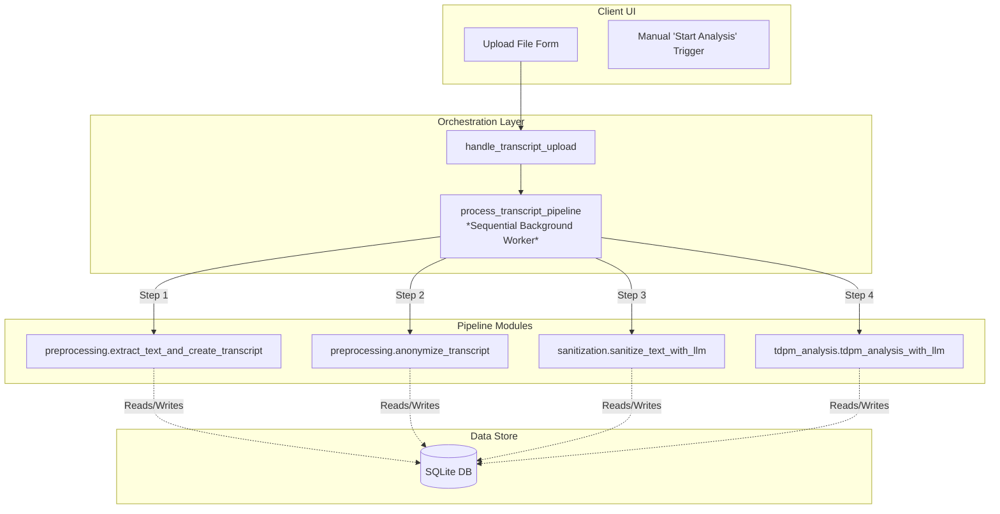

# Pipeline Modularity & Deferred Clinical Analysis Implementation Plan

This document assesses the current decoupling of the **Symptoms Analyser** processing pipeline and provides a concrete, step-by-step roadmap to enable a deferred/manual workflow. This allows users to upload a transcript, let the system pre-process and sanitize it, and trigger the **TDPM-20 clinical scoring** at a later time.

---

## 1. Modularity Assessment: How Decoupled is the Pipeline?

The analysis reveals that the system is **highly decoupled at the module and data tiers**, but **tightly coupled at the orchestration tier**.



### 1.1. Modularity Strengths (Highly Decoupled Data & Logic Layers)
*   **Pipeline Modularity**: The core steps are written as separate, self-contained Python modules under `src/symptoms_analyser/pipeline/` (`preprocessing.py`, `sanitization.py`, `tdpm_analysis.py`).
*   **Database-Driven Communication**: The modules communicate *exclusively* via the database using standard identifiers. For instance, `tdpm_analysis_with_llm` only requires a `transcript_id`, queries the `sanitized_text` from the `transcripts` table, runs the LLM analysis, and populates the `tdpm_evaluations` and clinical score tables. It does not require any active in-memory context from the preprocessing or sanitization steps.
*   **State-Machine Compatibility**: The database schema already defines all the states required for an interrupted or deferred pipeline:
    ```sql
    status TEXT NOT NULL DEFAULT 'queued' 
        CHECK (status IN ('queued', 'preprocessing', 'preprocessed', 'analyzing', 'completed', 'failed'))
    ```
    *   An upload-and-sanitize step ends exactly with `status = 'preprocessed'`.
    *   An analysis step transitions the status from `preprocessed` to `analyzing` and finally to `completed` or `failed`.

### 1.2. Modularity Weaknesses (Coupled Orchestration Layer)
*   **Sequential Orchestration**: In `controllers/transcript_upload.py`, a single background function (`process_transcript_pipeline`) runs all four stages sequentially in one thread block immediately upon upload:
    ```python
    # 1. Text Extraction
    extract_text_and_create_transcript(...)
    # 2. Local Anonymization
    anonymize_transcript(...)
    # 3. LLM Sanitization
    if apply_sanitization:
        sanitize_text_with_llm(...)
    # 4. TDPM Clinical scoring
    tdpm_analysis_with_llm(...)
    ```
*   **UI Assumption**: The Jinja template (`therapy_session_detail.html`) assumes a binary operational state: either the transcript is actively running (showing a processing spinner console) or it is fully completed (showing the finished clinical dashboard). There is currently no UI treatment for the intermediate state where a transcript exists in the `'preprocessed'` state but does not yet have an evaluation.

---

## 2. Proposed Deferred Workflow & State Transitions

To allow users to upload a transcript and manually submit it to TDPM analysis later, we will transition to a **two-phase async architecture**:

```
[ Upload File ]
      │
      ▼
┌────────────────────────────────────────────────────────┐
│ PHASE 1: Text Extraction, Anonymization & Sanitization │
└────────────────────────────────────────────────────────┘
      │
      ▼
┌────────────────────────────────────────────────────────┐
│ State: 'preprocessed' (Transcripts table)              │
│ UI: Displays Sanitized Transcript + 'Analyze' Button   │
└────────────────────────────────────────────────────────┘
      │
      ├─────────────────────────────────────────────────┐
      │ (Delayed / Manual User Trigger)                 │
      ▼                                                 ▼
┌─────────────────────────────┐           ┌─────────────────────────────┐
│ Action: Trigger Analysis    │           │ Action: Review Transcript   │
└─────────────────────────────┘           └─────────────────────────────┘
      │
      ▼
┌────────────────────────────────────────────────────────┐
│ PHASE 2: TDPM-20 AI Scoring & Evaluation Generation    │
└────────────────────────────────────────────────────────┘
      │
      ▼
┌────────────────────────────────────────────────────────┐
│ State: 'completed'                                     │
│ UI: Displays Full Clinical Symptoms Dashboard          │
└────────────────────────────────────────────────────────┘
```

---

## 3. Necessary Code Changes: Step-by-Step Implementation Guide

To implement this workflow, four files need simple, targeted modifications:

### Step 3.1: Backend Orchestrator & Controllers
We need to split `process_transcript_pipeline` in `src/symptoms_analyser/controllers/transcript_upload.py` and introduce a second background task for clinical analysis.

#### A. Split Orchestrator in `controllers/transcript_upload.py`
```python
# 1. Update the upload process worker to stop after sanitization
def process_transcript_upload_and_sanitize(
    task_id: str,
    filepath: Path,
    therapy_session_id: int,
    extract_metadata: bool,
    apply_sanitization: bool
) -> None:
    """Phase 1: Background worker that extracts text, anonymizes, and optionally sanitizes."""
    # ... setup connection ...
    # STEP 3a: Text Extraction
    extract_text_and_create_transcript(...)
    # STEP 3b: Anonymization
    anonymize_transcript(...)
    # STEP 4: LLM Sanitization (Optional)
    if apply_sanitization:
        sanitize_text_with_llm(...)
    else:
        orm.update_transcript(status="preprocessed", progress_percent=100.0, ...)

    # State is now 'preprocessed'
    task["status"] = "completed"

# 2. Add a new deferred clinical analysis background worker
def process_deferred_tdpm_analysis(
    task_id: str,
    transcript_id: int,
    evaluator_id: str = "clinician_1"
) -> None:
    """Phase 2: Background worker that executes TDPM-20 clinical analysis on a preprocessed transcript."""
    # ... setup connection ...
    tdpm_analysis_with_llm(
        transcript_id=transcript_id,
        blocks_per_call=100,
        evaluator_id=evaluator_id,
        db_conn=db_conn
    )
    task["status"] = "completed"
```

#### B. Add a manual trigger handler in `controllers/transcript_upload.py`
```python
def handle_deferred_analysis_trigger(transcript_id: int, evaluator_id: str = "clinician_1") -> str:
    """Initiates Phase 2 background thread and returns a unique Task ID."""
    task_id = str(uuid.uuid4())
    tasks[task_id] = {
        "status": "processing",
        "logs": ["Iniciando análise clínica postergada"],
        "error": ""
    }

    thread = threading.Thread(
        target=process_deferred_tdpm_analysis,
        args=(task_id, transcript_id, evaluator_id)
    )
    thread.start()
    return task_id
```

---

### Step 3.2: Flask API Routes
In `src/symptoms_analyser/app.py`, we expose the trigger handler to the frontend.

```python
@app.route("/api/transcripts/<int:transcript_id>/analyze", methods=["POST"])
def trigger_clinical_analysis(transcript_id):
    try:
        from symptoms_analyser.controllers.transcript_upload import handle_deferred_analysis_trigger
        
        # Pull clinician ID from current authenticated user context
        evaluator_id = "clinician_1" 
        
        task_id = handle_deferred_analysis_trigger(
            transcript_id=transcript_id,
            evaluator_id=evaluator_id
        )
        return jsonify({"success": True, "task_id": task_id})
    except Exception as e:
        return jsonify({"error": str(e)}), 500
```

---

### Step 3.3: Frontend UI (`therapy_session_detail.html`)
We will add a new view state to handle the intermediate condition: transcript uploaded/preprocessed, but clinical scores not yet calculated.

```html
<!-- In therapy_session_detail.html -->

    <!-- STATE 1: SESSION IS FULLY ANALYZED -->
    <!-- Displays clinical dashboard ... -->


    <!-- NEW STATE 1.5: TRANSCRIPT UPLOADED BUT PENDING TDPM ANALYSIS -->
    <div class="results-container centered-container-narrow">
        <div class="dashboard-card pending-analysis-card">
            <div class="pending-header flex-align-center-gap-sm mb-2">
                <span class="pending-icon">✓</span>
                <h3>Transcrição pré-processada com sucesso</h3>
            </div>
            <p class="mb-3 text-medium text-muted">
                A transcrição para a sessão <strong>{{ session.name }}</strong> foi salva, anonimizada localmente, e está pronta para análise de sintomas TDPM-20.
            </p>
            
            <div class="action-card-centered mb-4">
                <button type="button" class="btn btn-primary btn-lg btn-with-icon" id="btnStartClinicalAnalysis" data-transcript-id="{{ transcript.id }}">
                    <svg viewBox="0 0 24 24" width="20" height="20" fill="none" stroke="currentColor" stroke-width="2.5">
                        <path d="M22 12h-4l-3 9L9 3l-3 9H2"/>
                    </svg>
                    Iniciar Análise Clínica TDPM-20
                </button>
            </div>

            <!-- Pre-render preview of sanitized transcript turns -->
            <div class="transcript-preview-panel">
                <h4 class="mb-2">Visualização da transcrição (Texto sanitizado)</h4>
                <div class="transcript-preview-box">
                    <pre class="transcript-content-pre">{{ transcript.sanitized_text or transcript.raw_text }}</pre>
                </div>
            </div>
        </div>
    </div>


    <!-- STATE 2: PIPELINE IS ACTIVELY RUNNING -->
    <!-- Displays console with logs ... -->


    <!-- STATE 3: NO TRANSCRIPT UPLOADED -->
    <!-- Displays file upload dropzone ... -->

```

---

### Step 3.4: Client-Side Javascript (`therapy_session_detail.js`)
We wire the button click to trigger the manual analysis and switch the UI view to the processing console smoothly.

```javascript
// In therapy_session_detail.js (under STATE 3)
const btnStartClinicalAnalysis = document.getElementById('btnStartClinicalAnalysis');
if (btnStartClinicalAnalysis) {
    btnStartClinicalAnalysis.addEventListener('click', async () => {
        const transcriptId = btnStartClinicalAnalysis.dataset.transcriptId;
        
        // Transform the active view to showing the processing console
        const pendingCard = document.querySelector('.pending-analysis-card');
        const processingView = document.getElementById('processingView');
        const statusTitle = document.getElementById('statusTitle');
        const statusDesc = document.getElementById('statusDesc');
        
        hideElement(pendingCard);
        showElement(processingView, 'active');
        statusTitle.textContent = 'Executando Análise Clínica...';
        statusDesc.textContent = 'O pipeline de IA está pontuando os sintomas e gerando o prontuário. Acompanhe a telemetria abaixo.';
        
        addLog('Iniciando análise clínica por demanda', 'system');
        
        try {
            const response = await fetch(`/api/transcripts/${transcriptId}/analyze`, {
                method: 'POST'
            });
            const data = await response.json();
            
            if (response.ok && data.success) {
                // Reuse existing polling function
                activePolling = true;
                pollDatabaseStatusAfterUpload();
            } else {
                handleUploadError(data.error || 'Erro ao disparar análise.');
            }
        } catch (err) {
            handleUploadError('Erro de conexão ao solicitar análise.');
        }
    });
}
```

---

## 4. Architectural Summary

By implementing this, we leverage the existing modularity of the **Symptoms Analyser** pipeline. The actual processing code remains untouched, as its functions (`extract_text_and_create_transcript`, `sanitize_text_with_llm`, `tdpm_analysis_with_llm`) are already stateless and perfectly decoupled. The only changes are in the **orchestration logic** (separating linear threads into two asynchronous phases) and **the UI view mapping** (rendering an intermediate state panel with a primary "Start Clinical Analysis" button).
