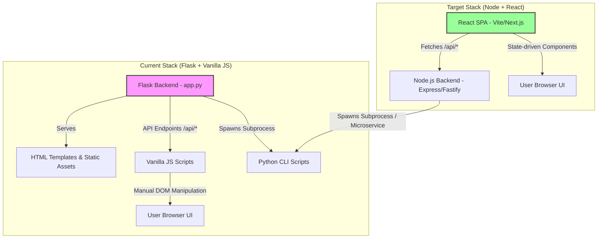
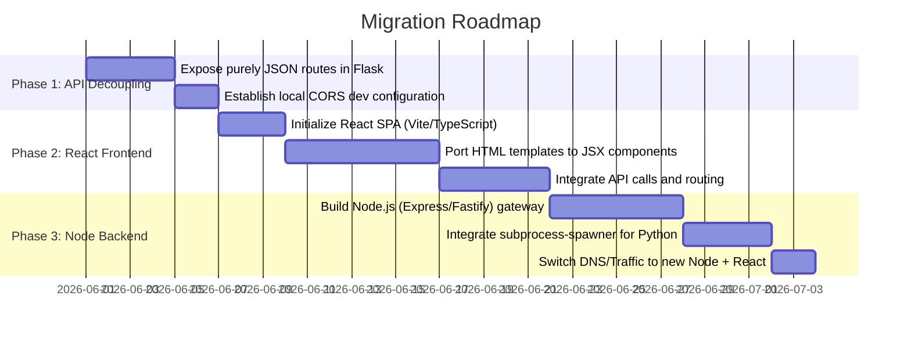

# Migration and Structural Standardization Guide: Flask/Vanilla to Node + React

This guide outlines how the **Symptoms Analyser** can be prepared for a future migration to a **Node.js (Backend) + React (Frontend)** stack. It details structural refactorings you can perform *in the current codebase* today to standardize the architecture, decouple concerns, and make a future transition simple and seamless.

---

## 1. Architectural Mapping: Current vs. Target Stack

To see how our components will migrate, consider this visual flow of the architecture:



Here is how the individual files and folders in the current project map to standard Node + React project structures:

| Current File / Directory | Role | Node + React Equivalent | Migration Strategy |
| :--- | :--- | :--- | :--- |
| `app.py` | Web server, Static server, REST API, Background Tasks | `server.js` (Express/Fastify) or Next.js API Routes | Node will act as the API gateway, serving static assets from a build folder and managing background jobs. |
| `templates/*.html` | HTML pages served via server-side routing | React Pages / Components (using React Router or Next.js Pages) | Port the template structures to JSX components. |
| `static/js/*.js` | UI rendering, API fetching, and State tracking | React Components, Custom Hooks, and API client (e.g., Axios) | Separate the JS code into pure API clients and state logic first, then map them directly to React hooks/components. |
| `static/css/styles.css` | Global styling and visual tokens | CSS Modules, styled-components, or Tailwind CSS | Standardize CSS variables and component-specific styles to easily convert them into CSS Modules or utility classes. |
| `preprocess.py` & `tdpm_analysis.py` | Core Python analysis pipeline (Data processing & LLM) | Kept as Python scripts or microservice | Node.js will spawn these scripts as child processes, or they will be wrapped in a microservice (e.g. FastAPI) to keep Python's data science ecosystem. |

---

## 2. Refactoring the Current Project for a Painless Migration

You don't need to write a single line of React to start preparing. By applying these **five structural changes** to the current codebase, you will align your architecture with standard modern SPA patterns, making the actual React migration a matter of copying and pasting logic.

### 2.1. Decouple Backend and Frontend (API-First Architecture)

> [!IMPORTANT]
> Currently, Flask is acting as both a web server (serving HTML templates via `render_template`) and an API gateway. In a Node + React setup, the frontend is compiled into a Single Page Application (SPA) that runs entirely in the browser, communicating with the backend *only* via JSON APIs.

#### Actionable Refactoring:
1. **Confine Flask to API routes**: Ensure all Flask routes serving HTML (e.g., `/`, `/upload`, `/viewer/analysis`) are purely static or redirect to a single index file. 
2. **Abstract Fetch Base URLs**: In the `static/js` files, currently we fetch relative paths like `fetch('/api/files')`. Group these configurations under a central API client config.
3. **Implement CORS**: Enable Cross-Origin Resource Sharing (CORS) in Flask. This allows you to run a standalone frontend dev server (like Vite on port `5173`) while keeping Flask on port `8000`.

*In your current `app.py`, you can add:*
```python
from flask_cors import CORS
CORS(app)  # Enables cross-origin requests from a separate React dev server
```

---

### 2.2. Extract State Management and API Logic from DOM Code

In React, the UI is a **pure function of state**. Right now, your Javascript files (e.g., `analysis.js`) mix three distinct concerns:
1. **API Requests**: Making raw `fetch` calls.
2. **State Storage**: Updating local variables and writing/reading from `localStorage`.
3. **DOM Rendering**: Calling `document.createElement`, setting `.innerHTML`, adding event listeners, and toggling active classes.

#### Actionable Refactoring:
Extract the API calls and state management into dedicated utilities. This isolates the DOM code, making it trivial to replace the DOM-writing parts with React JSX later.

For example, refactor the code inside `static/js/analysis.js` into modular functions:

```javascript
// ==========================================
// 1. API Services (api.js)
// ==========================================
const ApiService = {
    async fetchFiles() {
        const res = await fetch('/api/files');
        return res.json();
    },
    async fetchAnalysisData(filepath) {
        const res = await fetch(filepath);
        return res.json();
    }
};

// ==========================================
// 2. State & Storage (state.js)
// ==========================================
const AppState = {
    selectedFile: localStorage.getItem('viewer_selected_file') || '',
    selectedPatient: localStorage.getItem('viewer_selected_patient') || '',
    currentData: null,
    
    setSelectedFile(file) {
        this.selectedFile = file;
        localStorage.setItem('viewer_selected_file', file);
    },
    setSelectedPatient(patient) {
        this.selectedPatient = patient;
        localStorage.setItem('viewer_selected_patient', patient);
    }
};

// ==========================================
// 3. Render / UI Logic (analysis.js)
// ==========================================
function renderDashboard() {
    const data = AppState.currentData;
    if (!data) return;
    // ...pure DOM manipulation based solely on AppState...
}
```

> [!TIP]
> When you migrate to React, `ApiService` remains identical, `AppState` maps directly to a React Context or Zustand store, and `renderDashboard` gets replaced by React JSX markup.

---

### 2.3. Turn the Frontend into a Client-Side Single Page Application (SPA)

Right now, navigation is handled by Flask routing across several templates:
- `viewer_analysis.html`
- `viewer_compare.html`
- `viewer_calculator.html`
- `viewer_evolution.html`

In React, you will use a router (like `react-router-dom`) to load these "pages" dynamically inside a single `index.html` file.

#### Actionable Refactoring:
You can mimic this SPA behavior right now inside a single HTML file by using a simple **State-Based View Switcher** in Javascript:
1. Merge your separate HTML templates into a single `index.html` structure with container `<section>` tags for each tab (e.g., `<section id="viewAnalysis">`, `<section id="viewCompare">`).
2. Add a `currentTab` property to your global state.
3. Show/hide sections based on the active tab using a `.hidden` utility class in CSS.

```javascript
function switchView(viewName) {
    document.querySelectorAll('.app-view').forEach(view => {
        view.classList.toggle('hidden', view.id !== `view-${viewName}`);
    });
}
```
This reduces the Flask server routes down to one single entry point, aligning your current frontend perfectly with the React routing paradigm.

---

### 2.4. Keep Python CLI Scripts decoupled from Web Server Contexts

The current Flask application starts background tasks by executing shell commands via `subprocess.Popen` running `preprocess.py` and `tdpm_analysis.py`. 

This is already a **highly decoupleable and excellent architecture**. It means the core engine of your project is a set of command-line tools.

#### Actionable Refactoring:
1. Ensure `preprocess.py` and `tdpm_analysis.py` never import any Flask-related modules. Keep them strictly as pure CLI utilities.
2. Standardize their output formats and ensure they log status in structured JSON lines to standard output (stdout), e.g., `{"progress": 50, "stage": "preprocessing"}`.
3. When you migrate to Node.js, the backend can easily spawn these Python scripts using Node's native `child_process` library, parse the standard output stream, and push logs to the client via WebSockets or Server-Sent Events (SSE).

*Node.js equivalent of spawning the analysis process:*
```javascript
const { spawn } = require('child_process');

function runAnalysis(filePath) {
    const pythonProcess = spawn('python', ['tdpm_analysis.py', filePath, '--output', 'output/tdpm_analysis']);
    
    pythonProcess.stdout.on('data', (data) => {
        console.log(`Logs: ${data.toString()}`);
        // Send this line back to React via Server-Sent Events or WebSockets
    });
    
    pythonProcess.on('close', (code) => {
        console.log(`Process exited with code ${code}`);
    });
}
```

---

---

### 2.5. Standardize Data Contracts (JSON Schemas)

When the frontend and backend live in different ecosystems (Python/Flask backend vs. Node backend and React frontend), keeping data shapes uniform is key. 

#### Actionable Refactoring:
1. Create a `schemas/` directory inside `data/` containing mock `.json` samples of your backend's API responses (e.g., what `/api/files` returns, and what a `.tdpm.json` file contains).
2. Use this static data to build React components in isolation (using tools like Storybook or local mock states) before the backend is even migrated.

---

### 2.6. Transition from Flat JSON Files to a Database (SQLite)

> [!TIP]
> Transitioning your result storage from static `.json` files to a lightweight **SQLite database** is one of the most powerful moves you can make. It dramatically simplifies the migration to Node + React, serves as a clean bridge between Python and Node, and unlocks advanced querying features.

#### Why a Database Makes Migration Much Easier:
1. **Language-Independent Data Bridge**: Python scripts write outputs directly to the SQLite file, and Node.js queries them. Neither language needs to know about the other's internal structures—they just share a database.
2. **Simplified Backend APIs**: Instead of Flask/Node scraping a directory, parsing strings, sorting by timestamp in memory, and serving whole files, you write simple, high-performance SQL queries.
3. **Advanced Frontend Queries**: In React, you can build rich features such as search, date filters, sorting, and pagination without loading megabytes of JSON files into server memory.
4. **Efficient Multi-session Analytics**: For screens like the "Patient Evolution Dashboard", a database allows you to fetch *only* the specific scores over time rather than opening and parsing 15 distinct JSON files on every render.

#### Recommended SQLite Schema Strategies:

Depending on your timeline, you can choose one of two database strategies:

##### Approach A: Hybrid Document Store (Recommended for rapid migration)
Create a single `sessions` table that saves the entire clinical JSON payload inside a text column. SQLite natively supports JSON functions, allowing you to query deeply nested properties directly in SQL!
```sql
CREATE TABLE sessions (
    id TEXT PRIMARY KEY,           -- Unique UUID or Timestamp slug
    session_name TEXT NOT NULL,    -- e.g. "patient_interview_1"
    model TEXT,                    -- e.g. "gpt-4o"
    created_at DATETIME DEFAULT CURRENT_TIMESTAMP,
    data TEXT NOT NULL             -- The entire raw JSON string output of tdpm_analysis.py
);
```
*   **Pros**: 100% schema-flexible. If the TDPM-20 analysis changes its keys or prompt items in the future, you do not need to rewrite your database structure or run migrations.
*   **Node.js query equivalent**: 
    ```javascript
    // Fetch sessions list (very fast!)
    const sessions = db.prepare('SELECT id, session_name, model, created_at FROM sessions ORDER BY created_at DESC').all();
    ```

##### Approach B: Normalized Relational Store (Best for long-term clinical analytics)
Deconstruct the JSON payload into relational tables:
- `sessions` (id, session_name, model, created_at)
- `patients` (id, session_id, name)
- `dimension_scores` (id, patient_id, dimension_code, score, max_score)
- `evidence_quotes` (id, dimension_score_id, text)

*   **Pros**: Extremely powerful. Allows you to run precise relational queries like *"find all evidence quotes where patient='John' and dimension='Decepção' and severity > 3"*.

#### Actionable Steps to Implement in the Current Stack:
1. **In Python**: Update the ending of `tdpm_analysis.py` to write its output dictionary into an `analysis.db` SQLite database using Python's built-in `sqlite3` library instead of (or in addition to) writing a `.json` file.
2. **In Flask (`app.py`)**: Replace the static directory scraping code in `/api/files` with a simple database select query, and have `/output/<path:filepath>` load the JSON record from the database.
3. **In Node.js (Future)**: Connect to the same `analysis.db` file using standard libraries like `better-sqlite3` or ORMs like `Prisma` / `Drizzle`. The transition is completely transparent.

---


## 3. Recommended Migration Path: Step-by-Step

If you decide to migrate the project, here is the recommended pathway to avoid downtime:



### Phase 1: Establish the API Contract & React Structure
1. Keep the Flask server running as it is.
2. Initialize a frontend project using **Vite + React (TypeScript)** or **Next.js**.
3. Create your custom React components (`Dashboard`, `ClinicalHeatmap`, `CompareView`, `UploadForm`).
4. Configure Vite's dev proxy in `vite.config.js` to redirect `/api` requests to Flask (running on port `8000`). This lets you build the entire React frontend in a premium dev environment without rewriting any backend logic!

### Phase 2: Port templates to Component Architecture
For each dashboard template, break it down into modular, reusable components:
- **`Sidebar`**: Manages view navigation state.
- **`FileSelector`**: Calls `fetchFiles()` and triggers data loads.
- **`PatientTabs`**: Displays individual patients, updating the global patient selection state.
- **`AccordionItem`**: Standardizes the dimensions detail views (collapsible states become standard React `useState` variables).

### Phase 3: Replace Flask with Node.js
Once the React frontend is fully verified and running against the Flask APIs:
1. Build an Express.js or NestJS backend.
2. Port the endpoints (`/api/files`, `/api/upload`, `/api/status/:id`) to Node.
3. Write a small subprocess wrapper in Node to spawn the existing python scripts.
4. Replace the Flask server entirely. The transition is complete!
