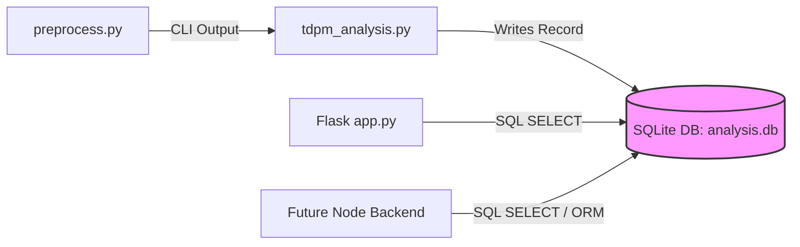

# Database Migration Guide: Migrating JSON Results to SQLite

This guide provides a complete, step-by-step blueprint for moving the **Symptoms Analyser** storage system from raw static `.json` files to a lightweight **SQLite database** (`analysis.db`). 

---

## 1. Migration Goals & Architecture

Currently, clinical session results are written as standalone `.json` files in `output/tdpm_analysis/`. Moving to SQLite establishes a clear, unified data boundary:



By completing this migration, you will:
- **Decouple the backend**: The web server (whether Flask or Node.js) no longer scans directories or parses physical file strings on every request.
- **Enable historical analysis**: Querying patient records over time (e.g., evolution metrics) takes milliseconds instead of opening and parsing multiple large text files in memory.
- **Prepare for Node/React**: The React frontend can perform paginated, sorted, and filtered API requests natively supported by SQLite.

---

## 2. SQLite Schema Design

We will use the **Hybrid Document Store** approach. It is 100% schema-flexible, meaning if your LLM prompts or output models change, you do not need to rewrite your database tables. We save metadata in distinct fields (for fast sorting and filtering) and store the full clinical payload in a JSON-optimized text block.

### SQL Table Schema:
```sql
CREATE TABLE IF NOT EXISTS tdpm_evaluations (
    id TEXT PRIMARY KEY,               -- Unique UUID or standardized timestamp
    transcript_id TEXT NOT NULL,       -- FK reference to transcripts
    evaluator_id TEXT,                 -- FK reference to users
    parent_evaluation_id TEXT,         -- Self FK reference for human revised reviews
    evaluation_type TEXT NOT NULL DEFAULT 'automated', -- classification
    session_name TEXT NOT NULL,        -- e.g. "interview_session_1"
    created_at DATETIME NOT NULL       -- Accurate creation timestamp
);

-- Index for instant sorting by date
CREATE INDEX IF NOT EXISTS idx_evaluations_created_at ON tdpm_evaluations (created_at DESC);
-- Index for session name filtering
CREATE INDEX IF NOT EXISTS idx_evaluations_name ON tdpm_evaluations (session_name);

CREATE TABLE IF NOT EXISTS evaluation_telemetry (
    evaluation_id TEXT PRIMARY KEY,    -- FK reference to tdpm_evaluations.id
    model TEXT NOT NULL,               -- e.g. "gpt-4o"
    chunks_analyzed INTEGER,           -- e.g. 5
    blocks_per_call INTEGER,
    prompt_tokens INTEGER,             -- Token consumption metrics
    completion_tokens INTEGER,
    total_elapsed_seconds REAL,
    status TEXT NOT NULL DEFAULT 'success',
    failure_reason TEXT,
    raw_payload TEXT NOT NULL,         -- The complete output JSON string
    created_at DATETIME DEFAULT CURRENT_TIMESTAMP,
    FOREIGN KEY (evaluation_id) REFERENCES tdpm_evaluations(id) ON DELETE CASCADE
);
```

---

## 3. Python Migration Script: JSON to SQLite

You can run this migration script right now. It parses all existing `.tdpm.json` files in `output/tdpm_analysis/`, extracts their data, and imports them cleanly into your new SQLite database (`analysis.db`).

Save this script as `migrate_to_sqlite.py` in your project root and run it:

```python
import os
import re
import json
import sqlite3
from pathlib import Path
from datetime import datetime

# Paths
DB_PATH = Path("data/analysis.db")
OUTPUT_DIR = Path("output/tdpm_analysis")

def setup_database():
    DB_PATH.parent.mkdir(parents=True, exist_ok=True)
    conn = sqlite3.connect(DB_PATH)
    cursor = conn.cursor()
    
    # Create tables
    cursor.execute("""
        CREATE TABLE IF NOT EXISTS tdpm_evaluations (
            id TEXT PRIMARY KEY,
            transcript_id TEXT NOT NULL,
            evaluator_id TEXT,
            parent_evaluation_id TEXT,
            evaluation_type TEXT NOT NULL DEFAULT 'automated',
            session_name TEXT NOT NULL,
            created_at DATETIME NOT NULL
        )
    """)
    cursor.execute("CREATE INDEX IF NOT EXISTS idx_evaluations_created_at ON tdpm_evaluations (created_at DESC)")
    cursor.execute("CREATE INDEX IF NOT EXISTS idx_evaluations_name ON tdpm_evaluations (session_name)")
    
    cursor.execute("""
        CREATE TABLE IF NOT EXISTS evaluation_telemetry (
            evaluation_id TEXT PRIMARY KEY,
            model TEXT NOT NULL,
            chunks_analyzed INTEGER,
            blocks_per_call INTEGER,
            prompt_tokens INTEGER,
            completion_tokens INTEGER,
            total_elapsed_seconds REAL,
            status TEXT NOT NULL DEFAULT 'success',
            failure_reason TEXT,
            raw_payload TEXT NOT NULL,
            FOREIGN KEY (evaluation_id) REFERENCES tdpm_evaluations(id) ON DELETE CASCADE
        )
    """)
    conn.commit()
    return conn

def extract_timestamp(filename, mtime):
    # Match standard timestamp like 20260524_200000
    match = re.search(r"(\d{8}_\d{6})", filename)
    if match:
        ts_str = match.group(1)
        try:
            return datetime.strptime(ts_str, "%Y%m%d_%H%M%S")
        except ValueError:
            pass
    return datetime.fromtimestamp(mtime)

def run_migration():
    print("Iniciando migração dos arquivos JSON para o SQLite...")
    conn = setup_database()
    cursor = conn.cursor()
    
    json_files = list(OUTPUT_DIR.glob("*.tdpm.json"))
    print(f"Encontrados {len(json_files)} arquivos de análise para migrar.")
    
    migrated_count = 0
    for file_path in json_files:
        try:
            with open(file_path, "r", encoding="utf-8") as f:
                data = json.load(f)
            
            # Identify core fields
            session_name = data.get("session", file_path.stem.replace(".tdpm", ""))
            model = data.get("model", "unknown")
            chunks = data.get("chunks_analyzed", 0)
            
            token_usage = data.get("token_usage", {})
            prompt_tokens = token_usage.get("prompt_tokens") if token_usage else None
            completion_tokens = token_usage.get("completion_tokens") if token_usage else None
            
            # Determine correct created_at datetime
            file_mtime = os.path.getmtime(file_path)
            created_at = extract_timestamp(file_path.name, file_mtime)
            
            # Unique session identifier
            session_id = file_path.stem
            
            # Insert into database (clinical assessment)
            cursor.execute("""
                INSERT OR REPLACE INTO tdpm_evaluations 
                (id, transcript_id, evaluation_type, session_name, created_at)
                VALUES (?, ?, 'automated', ?, ?)
            """, (
                session_id,
                "dummy_transcript_id", # Placeholder for migration guide script simplicity
                session_name,
                created_at.strftime("%Y-%m-%d %H:%M:%S")
            ))
            
            # Insert execution telemetry
            cursor.execute("""
                INSERT OR REPLACE INTO evaluation_telemetry 
                (evaluation_id, model, chunks_analyzed, prompt_tokens, completion_tokens, raw_payload)
                VALUES (?, ?, ?, ?, ?, ?)
            """, (
                session_id,
                model,
                chunks,
                prompt_tokens,
                completion_tokens,
                json.dumps(data, ensure_ascii=False)
            ))
            migrated_count += 1
            print(f"✔ Migrado: {file_path.name}")
            
        except Exception as e:
            print(f"❌ Erro ao migrar {file_path.name}: {str(e)}")
            
    conn.commit()
    conn.close()
    print(f"\nMigração concluída com sucesso! {migrated_count} sessões inseridas em {DB_PATH}.")

if __name__ == "__main__":
    run_migration()
```

---

## 4. Modifying your Pipeline (`tdpm_analysis.py`)

To ensure that future analysis runs automatically save directly into the SQLite database, update the saving routine inside your pipeline script (`tdpm_analysis.py`).

Replace the pure JSON output writing routine:

```python
# =====================================================================
# Old Code (Pure file system writing)
# =====================================================================
# output_path = os.path.join(args.output, f"{session_name}.tdpm.json")
# with open(output_path, "w") as f:
#     json.dump(final_output, f, indent=2)

# =====================================================================
# New Code (Writes to file AND database)
# =====================================================================
import sqlite3
from datetime import datetime

# 1. Write the backup JSON file as usual (optional, good for safety)
output_path = os.path.join(args.output, f"{session_name}.tdpm.json")
with open(output_path, "w", encoding="utf-8") as f:
    json.dump(final_output, f, indent=2, ensure_ascii=False)

# 2. Insert record into SQLite
try:
    db_path = "data/analysis.db"
    conn = sqlite3.connect(db_path)
    cursor = conn.cursor()
    
    # Extract metadata
    session_id = session_name  # Containing timestamp
    simple_name = final_output.get("session", session_name)
    model = final_output.get("model", "unknown")
    chunks = final_output.get("chunks_analyzed", 0)
    
    token_usage = final_output.get("token_usage", {})
    prompt_tokens = token_usage.get("prompt_tokens") if token_usage else None
    completion_tokens = token_usage.get("completion_tokens") if token_usage else None
    
    # 2. Insert clinical record
    cursor.execute("""
        INSERT OR REPLACE INTO tdpm_evaluations 
        (id, transcript_id, evaluation_type, session_name, created_at)
        VALUES (?, ?, 'automated', ?, ?)
    """, (
        session_id,
        "dummy_transcript_id", # In standard pipelines this will be the real transcript_id
        simple_name,
        datetime.now().strftime("%Y-%m-%d %H:%M:%S")
    ))
    
    # 3. Insert technical telemetry
    cursor.execute("""
        INSERT OR REPLACE INTO evaluation_telemetry 
        (evaluation_id, model, chunks_analyzed, prompt_tokens, completion_tokens, raw_payload)
        VALUES (?, ?, ?, ?, ?, ?)
    """, (
        session_id,
        model,
        chunks,
        prompt_tokens,
        completion_tokens,
        json.dumps(final_output, ensure_ascii=False)
    ))
    conn.commit()
    conn.close()
    print(f"Análise gravada com sucesso no SQLite em: {db_path}")
except Exception as e:
    print(f"Erro ao salvar dados no SQLite: {str(e)}")
```

---

## 5. Updating the Flask Backend (`app.py`)

Now update the API endpoints in your active Flask application `app.py` to query the SQLite database. This instantly eliminates complex file scanning logic!

### 5.1. Update listing route `/api/files`
```python
import sqlite3

@app.route('/api/files')
def list_files():
    try:
        conn = sqlite3.connect('data/analysis.db')
        conn.row_factory = sqlite3.Row  # Access columns by name
        cursor = conn.cursor()
        
        cursor.execute("SELECT id, session_name, created_at FROM tdpm_evaluations ORDER BY created_at DESC")
        rows = cursor.fetchall()
        
        files = []
        for row in rows:
            files.append({
                "name": f"{row['id']}.tdpm.json",
                # Our API endpoint will load files by their DB primary ID now
                "path": f"/api/analysis/{row['id']}"
            })
            
        conn.close()
        return jsonify(files)
    except Exception as e:
        return jsonify({"error": str(e)}), 500
```

### 5.2. Replace file serving route `/output/<path:filepath>` with dynamic DB lookup `/api/analysis/<id>`
Update your static JavaScript files to pull from this secure, clean API endpoint:

```python
@app.route('/api/analysis/<session_id>')
def serve_analysis_data(session_id):
    try:
        conn = sqlite3.connect('data/analysis.db')
        cursor = conn.cursor()
        
        cursor.execute("SELECT raw_payload FROM evaluation_telemetry WHERE evaluation_id = ?", (session_id,))
        row = cursor.fetchone()
        conn.close()
        
        if row is None:
            return jsonify({"error": "Sessão não encontrada no banco de dados."}), 404
            
        # Parse the JSON string back to dict to serve standard JSON response
        data = json.loads(row[0])
        return jsonify(data)
        
    except Exception as e:
        return jsonify({"error": str(e)}), 500
```

---

## 6. How it integrates with Node + React (The Future)

Once you complete your Node.js migration, you will no longer need Flask or Python to read and serve session results. Node.js connects directly to `analysis.db`!

Here is how simple your Express.js API endpoint becomes using `better-sqlite3` (the gold standard for Node.js + SQLite integration):

```javascript
const express = require('express');
const Database = require('better-sqlite3');
const router = express.Router();

const db = new Database('./data/analysis.db');

// API: Get all analysis sessions
router.get('/api/files', (req, res) => {
    try {
                const rows = db.prepare('SELECT id, session_name, created_at FROM tdpm_evaluations ORDER BY created_at DESC').all();
        
        const files = rows.map(row => ({
            name: `${row.id}.tdpm.json`,
            path: `/api/analysis/${row.id}`
        }));
        
        res.json(files);
    } catch (err) {
        res.status(500).json({ error: err.message });
    }
});

// API: Get detailed JSON payload by session ID
router.get('/api/analysis/:id', (req, res) => {
    try {
        const row = db.prepare('SELECT raw_payload FROM evaluation_telemetry WHERE evaluation_id = ?').get(req.params.id);
        
        if (!row) {
            return res.status(404).json({ error: 'Session not found' });
        }
        
        // Parse the stored string payload and return structured JSON
        res.json(JSON.parse(row.raw_payload));
    } catch (err) {
        res.status(500).json({ error: err.message });
    }
});

module.exports = router;
```

---

## 7. Verifying the Migration

After running `migrate_to_sqlite.py`, you can easily query the SQLite database from your terminal:

```bash
sqlite3 data/analysis.db "SELECT e.id, e.session_name, t.model, e.created_at FROM tdpm_evaluations e JOIN evaluation_telemetry t ON e.id = t.evaluation_id LIMIT 5;"
```

This guarantees that all analytical data is perfectly structured and ready for high-performance React UI applications!
