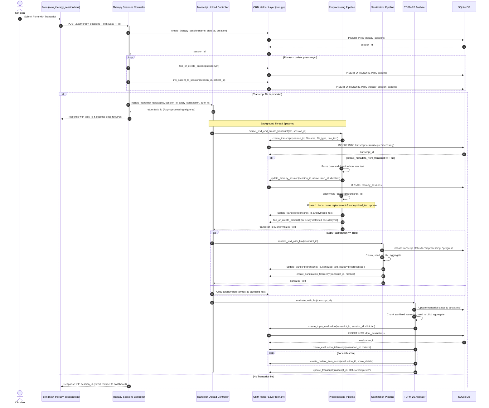

# Transcript analysis pipeline

## Sequence Workflow & Step-by-Step Data Flow

The diagram below maps the complete lifecycle of a therapy session registration and transcript ingestion:

```mermaid
sequenceDiagram
    autonumber
    actor Clinician
    participant UI as Form (new_therapy_session.html)
    participant TS_Ctrl as Therapy Sessions Controller
    participant TU_Ctrl as Transcript Upload Controller
    participant ORM as ORM Helper Layer (orm.py)
    participant Prep as Preprocessing Pipeline
    participant Sanit as Sanitization Pipeline
    participant TDPM as TDPM-20 Analyzer
    participant DB as SQLite DB

    Clinician->>UI: Submit Form with Transcript
    UI->>TS_Ctrl: POST /api/therapy_sessions (Form Data + File)
    activate TS_Ctrl
    
    TS_Ctrl->>ORM: create_therapy_session(name, start_at, duration)
    ORM->>DB: INSERT INTO therapy_sessions
    DB-->>ORM: session_id
    ORM-->>TS_Ctrl: session_id

    loop For each patient pseudonym
        TS_Ctrl->>ORM: find_or_create_patient(pseudonym)
        ORM->>DB: INSERT OR IGNORE INTO patients
        TS_Ctrl->>ORM: link_patient_to_session(session_id, patient_id)
        ORM->>DB: INSERT OR IGNORE INTO therapy_session_patients
    end

    alt Transcript file is provided
        TS_Ctrl->>TU_Ctrl: handle_transcript_upload(file, session_id, apply_sanitization, auto_fill)
        activate TU_Ctrl
        TU_Ctrl-->>TS_Ctrl: return task_id (Async processing triggered)
        TS_Ctrl-->>UI: Response with task_id & success (Redirect/Poll)
        deactivate TS_Ctrl

        Note over TU_Ctrl, Prep: Background Thread Spawned
        
        TU_Ctrl->>Prep: extract_text_and_create_transcript(file, session_id)
        activate Prep
        Prep->>ORM: create_transcript(session_id, filename, file_type, raw_text)
        ORM->>DB: INSERT INTO transcripts (status='preprocessing')
        DB-->>ORM: transcript_id
        
        alt extract_metadata_from_transcript == True
            Prep->>Prep: Parse date and duration from raw text
            Prep->>ORM: update_therapy_session(session_id, name, start_at, duration)
            ORM->>DB: UPDATE therapy_sessions
        end
        
        Prep->>Prep: anonymize_transcript(transcript_id)
        Note over Prep: Phase 1: Local name replacement & anonymized_text update
        Prep->>ORM: update_transcript(transcript_id, anonymized_text)
        Prep->>ORM: find_or_create_patient() [for newly detected pseudonyms]
        Prep-->>TU_Ctrl: transcript_id & anonymized_text
        deactivate Prep

        alt apply_sanitization == True
            TU_Ctrl->>Sanit: sanitize_text_with_llm(transcript_id)
            activate Sanit
            Sanit->>DB: Update transcript status to 'preprocessing' / progress
            Sanit->>Sanit: Chunk, send to LLM, aggregate
            Sanit->>ORM: update_transcript(transcript_id, sanitized_text, status='preprocessed')
            Sanit->>ORM: create_sanitization_telemetry(transcript_id, metrics)
            Sanit-->>TU_Ctrl: sanitized_text
            deactivate Sanit
        else
            TU_Ctrl->>ORM: Copy anonymized/raw text to sanitized_text
        end

        TU_Ctrl->>TDPM: evaluate_with_llm(transcript_id)
        activate TDPM
        TDPM->>DB: Update transcript status to 'analyzing'
        TDPM->>TDPM: Chunk sanitized transcript, send to LLM, aggregate
        TDPM->>ORM: create_tdpm_evaluation(transcript_id, session_id, clinician)
        ORM->>DB: INSERT INTO tdpm_evaluations
        DB-->>ORM: evaluation_id
        
        TDPM->>ORM: create_evaluation_telemetry(evaluation_id, metrics)
        loop For each score
            TDPM->>ORM: create_patient_item_score(evaluation_id, score_details)
        end
        
        TDPM->>ORM: update_transcript(transcript_id, status='completed')
        deactivate TDPM
        deactivate TU_Ctrl
    else No Transcript file
        TS_Ctrl-->>UI: Response with session_id (Direct redirect to dashboard)
    end
```
