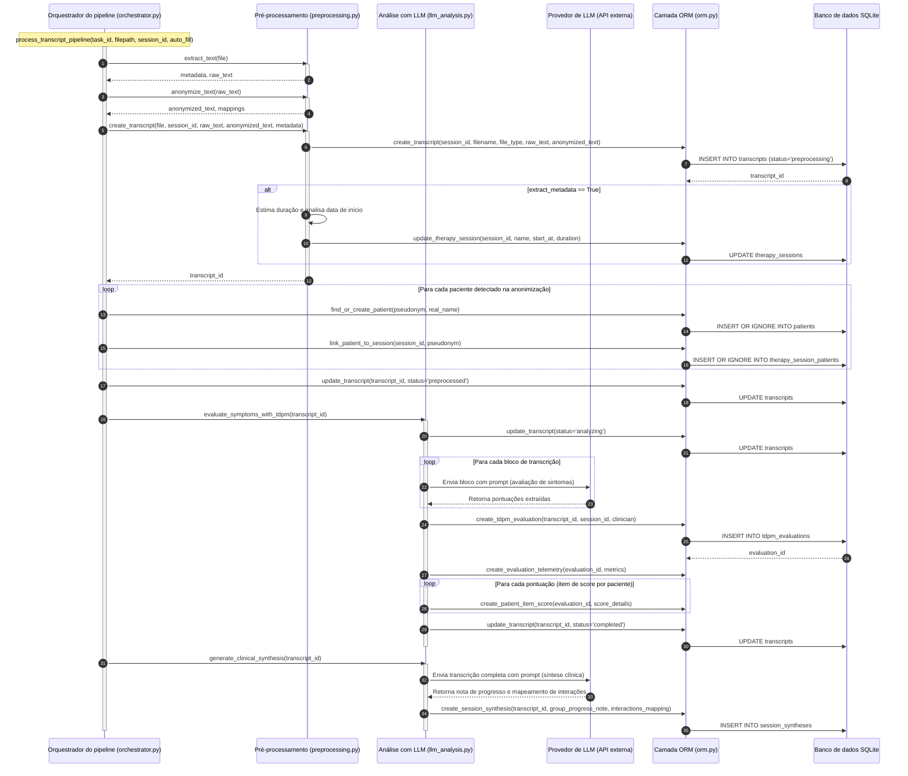
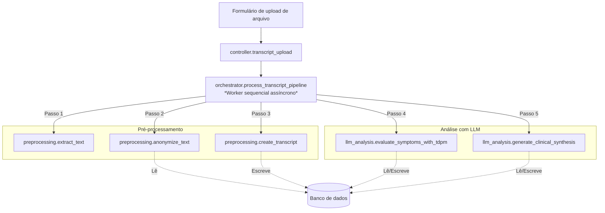

# Pipeline de análise de transcrição

Este documento descreve o fluxo de trabalho, o fluxo de dados e a arquitetura de modularidade do pipeline de processamento de transcrições do **Symptoms Analyser**.

---

## 1. Diagrama de sequência

O diagrama abaixo mapeia as etapas sequenciais executadas pelo orquestrador durante o processamento de uma transcrição:

---

## 2. Arquitetura do pipeline

A orquestração do pipeline é projetada para rodar de forma assíncrona e desacoplada dos controladores HTTP (web).

### 2.1. Orquestração e fluxo de execução

1. **Gatilho e assincronismo**: Quando uma nova transcrição é recebida, o controlador `controllers/transcript_upload.py` delega o processamento ao orquestrador iniciando uma thread em segundo plano com a função `process_transcript_pipeline` (em `pipeline/orchestrator.py`). Isso permite que a requisição HTTP responda de imediato com um identificador de tarefa (`task_id`), evitando o bloqueio da interface do usuário.
2. **Monitoramento e polling**: Durante a execução, o orquestrador atualiza um dicionário global de tarefas em memória (`tasks`), registrando mensagens de log detalhadas e o status atual. O cliente consome esses dados via requisições de consulta periódica (*polling*) para atualizar a barra de progresso na interface.
3. **Conexão e concorrência no banco de dados**: Para garantir a integridade transacional no SQLite durante o processamento em segundo plano, o orquestrador gerencia conexões dedicadas configuradas explicitamente com o modo Write-Ahead Logging (WAL) ativo e tratamento robusto de travamentos.
4. **Sequenciamento de etapas**: O fluxo executa as etapas de forma sequencial, atualizando o status do registro a cada transição:
   * **Extração de texto**: Lê o arquivo de entrada físico (`.txt` ou `.docx`) e extrai o texto bruto e metadados básicos.
   * **Anonimização local**: Realiza a substituição de nomes próprios de pacientes por pseudônimos estruturados (ex: `Paciente1`), consultando registros existentes para manter a consistência e criando automaticamente novas relações de paciente/sessão.
   * **Criação do registro**: Salva a transcrição no banco de dados com o status `preprocessed` e, caso configurado, atualiza os metadados da sessão de terapia associada (como nome público estimado e duração).
   * **Avaliação clínica TDPM-20**: Divide a transcrição em blocos e envia-os de forma iterativa ao provedor de LLM para pontuar as dimensões clínicas.
   * **Síntese clínica**: Invoca o provedor de LLM para gerar uma análise qualitativa (nota de progresso do grupo) e o mapa de interações sociais da sessão.

O diagrama de blocos abaixo descreve como os componentes se relacionam e interagem com o banco de dados:

### 2.2. Máquina de estados do processamento

O progresso e o ciclo de vida do pipeline são gerenciados por meio de uma máquina de estados persistida na coluna `status` da tabela `transcripts`. Esse controle permite monitorar o progresso em tempo real e identificar pontos de falha:
*   **queued**: A transcrição foi recebida e aguarda o início do processamento.
*   **preprocessing**: O texto está sendo extraído e anonimizado localmente.
*   **preprocessed**: A etapa de pré-processamento foi concluída com sucesso e o arquivo está pronto para a análise clínica.
*   **analyzing**: O pipeline está executando a avaliação clínica TDPM-20 e a síntese por meio de chamadas à API de LLM.
*   **completed**: Todo o fluxo foi finalizado com sucesso e os resultados estão salvos.
*   **failed**: Ocorreu um erro em alguma das etapas (com o rastreamento salvo na coluna `error_message`).
