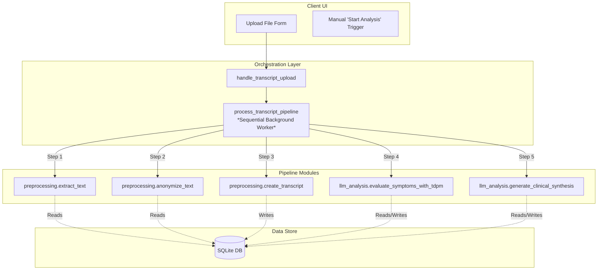

# Pipeline Modularity

This document assesses the current decoupling of the **Symptoms Analyser** processing pipeline.

---

## 1. Modularity Assessment: How Decoupled is the Pipeline?

The analysis reveals that the system is **highly decoupled at the module and data tiers**, but **tightly coupled at the orchestration tier**.



### 1.1. Modularity Strengths (Highly Decoupled Data & Logic Layers)
*   **Pipeline Modularity**: The core steps are written as separate, self-contained Python modules under `src/symptoms_analyser/pipeline/` (`preprocessing.py`, `llm_analysis.py`).
*   **Database-Driven Communication**: The modules communicate *exclusively* via the database using standard identifiers. For instance, `evaluate_symptoms_with_tdpm` only requires a `transcript_id`, queries the `sanitized_text` from the `transcripts` table, runs the LLM analysis, and populates the `tdpm_evaluations` and clinical score tables. It does not require any active in-memory context from the preprocessing steps.
*   **State-Machine Compatibility**: The database schema already defines all the states required for an interrupted or deferred pipeline:
    ```sql
    status TEXT NOT NULL DEFAULT 'queued' 
        CHECK (status IN ('queued', 'preprocessing', 'preprocessed', 'analyzing', 'completed', 'failed'))
    ```
    *   An upload-and-preprocess step ends exactly with `status = 'preprocessed'`.
    *   An analysis step transitions the status from `preprocessed` to `analyzing` and finally to `completed` or `failed`.

### 1.2. Modularity Weaknesses (Coupled Orchestration Layer)
*   **Sequential Orchestration**: In `controllers/transcript_upload.py`, a single background function (`process_transcript_pipeline`) runs all stages sequentially in one thread block immediately upon upload:
    ```python
    # 1. Text Extraction
    extract_text(...)
    # 2. Local Anonymization
    anonymize_text(...)
    # 3. Create Transcript Record
    create_transcript(...)
    # 4. TDPM Clinical scoring
    evaluate_symptoms_with_tdpm(...)
    # 5. Clinical Synthesis
    generate_clinical_synthesis(...)
    ```
*   **UI Assumption**: The Jinja template (`therapy_session_detail.html`) assumes a binary operational state: either the transcript is actively running (showing a processing spinner console) or it is fully completed (showing the finished clinical dashboard). There is currently no UI treatment for the intermediate state where a transcript exists in the `'preprocessed'` state but does not yet have an evaluation.
